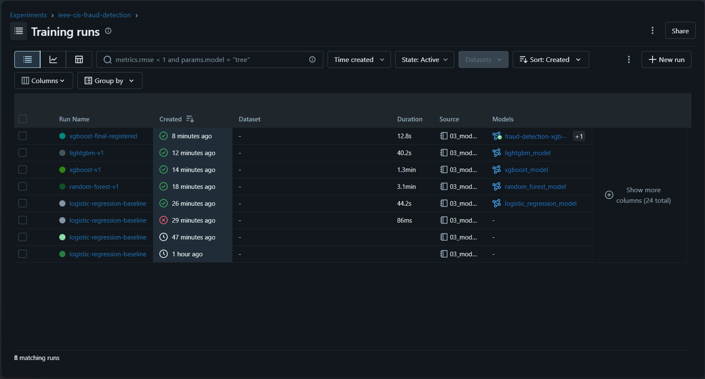
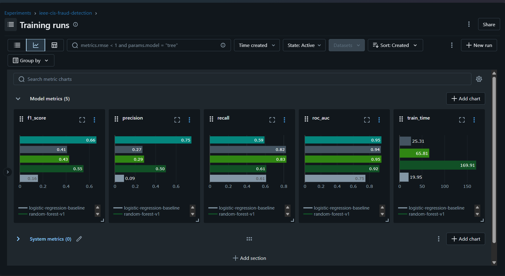
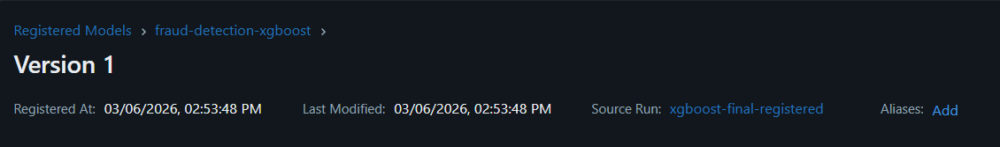
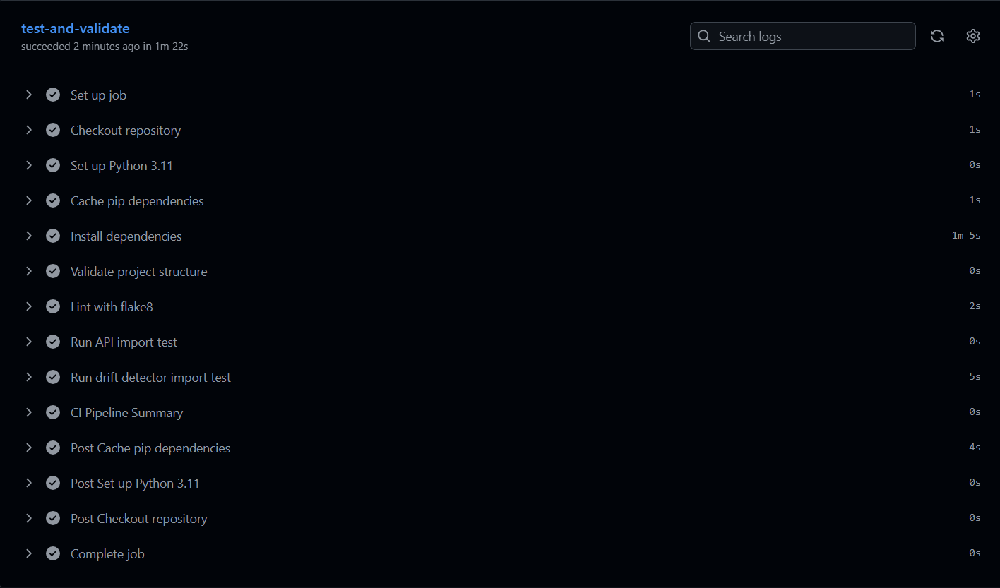

# Real-Time Financial Fraud Detection System with MLOps & Drift Monitoring

An end-to-end machine learning system for detecting fraudulent transactions 
in real-time, built on the IEEE-CIS Fraud Detection dataset. This project 
covers the full ML lifecycle — from exploratory data analysis to model 
deployment, monitoring, and CI/CD automation.

---

## Project Architecture
```
Raw Data (IEEE-CIS)
      ↓
Exploratory Data Analysis
      ↓
Feature Engineering (424 features)
      ↓
Model Training + MLflow Tracking
(Logistic Regression → Random Forest → XGBoost → LightGBM)
      ↓
Best Model Registration (XGBoost — F1: 0.6618, ROC-AUC: 0.9485)
      ↓
FastAPI REST Deployment (<50ms inference)
      ↓
Evidently AI Drift Monitoring
      ↓
Docker + GitHub Actions CI/CD
```

---

## Results

| Model | Default F1 | Tuned F1 | ROC-AUC | Train Time |
|---|---|---|---|---|
| Logistic Regression | 0.1564 | 0.2153 | 0.7499 | 19.95s |
| Random Forest | 0.5503 | 0.5839 | 0.9236 | 169.91s |
| **XGBoost** | **0.4261** | **0.6618** | **0.9485** | **65.81s** |
| LightGBM | 0.4078 | 0.6460 | 0.9418 | 25.31s |

**Best Model: XGBoost**
- Optimal Threshold : 0.8348
- F1-Score          : 0.6618
- ROC-AUC           : 0.9485
- Precision         : 0.7509
- Recall            : 0.5916

---

## Dataset

- **Source:** IEEE-CIS Fraud Detection (Kaggle Competition — Vesta Corporation)
- **Size:** 590,540 transactions across 434 features
- **Fraud Rate:** 3.50% (27.6:1 class imbalance)
- **Date Range:** 183 days of transaction data

---

## Key Findings from EDA

- Fraud transactions peak at **23:00** while legitimate transactions peak at **19:00**
- **Product C** has the highest fraud rate at **11.69%** — 3x higher than Product W
- **Discover cards** show the highest fraud rate at **7.73%**
- Transactions **with identity data** have 3.8x higher fraud rate (7.96% vs 2.10%)
- **V257, V246, V244** are the strongest predictors (correlation > 0.36)
- Transaction amounts are right-skewed — log transform reduced skewness by **96.6%**

---

## Feature Engineering

- Dropped 12 features with >90% missing values
- Extracted 4 time-based features from TransactionDT (hour, day_of_week, day_of_month, week)
- Log-transformed TransactionAmt (skewness: 14.37 → 0.49)
- Created `has_identity` binary flag (strong fraud signal — 3.8x ratio)
- Label encoded 29 categorical features
- Median imputed 98.4M missing cells across 374 features
- Stratified 80/20 train/test split preserving 3.50% fraud ratio

---

## MLflow Experiment Tracking

All experiments tracked with parameters, metrics and artifacts.





---

## API Endpoints

| Endpoint | Method | Description |
|---|---|---|
| `/health` | GET | API health check + model status |
| `/predict` | POST | Real-time fraud prediction |
| `/model/info` | GET | Model metadata and metrics |
| `/docs` | GET | Swagger UI |

### Sample Request
```bash
curl -X POST http://localhost:8000/predict \
  -H "Content-Type: application/json" \
  -d '{
    "TransactionAmt": 980.0,
    "hour": 23,
    "has_identity": 1,
    "ProductCD": 0
  }'
```

### Sample Response
```json
{
  "is_fraud": false,
  "fraud_probability": 0.3955,
  "risk_level": "LOW",
  "threshold_used": 0.8348,
  "inference_time_ms": 45.29
}
```

---

## Drift Monitoring

Automated data drift detection using Evidently AI across 10 key features.

| Scenario | Drifted Features | Drift Score | Alert |
|---|---|---|---|
| Normal | 0 / 10 | 0.0 | NO ACTION NEEDED |
| Moderate | 3 / 10 | 0.3 | NO ACTION NEEDED |
| Severe | 6 / 10 | 0.6 | RETRAINING REQUIRED |

HTML drift reports saved to `monitoring/reports/`

---

## CI/CD Pipeline



Every push to `main` triggers:
1. Python 3.11 environment setup
2. Dependency installation
3. Project structure validation
4. API config validation (424 features)
5. Drift detector validation

---

## Tech Stack

| Category | Tools |
|---|---|
| Data Analysis | Pandas, NumPy, Matplotlib, Seaborn |
| Machine Learning | Scikit-learn, XGBoost, LightGBM, SMOTE |
| Experiment Tracking | MLflow |
| API | FastAPI, Pydantic, Uvicorn |
| Monitoring | Evidently AI |
| DevOps | Docker, GitHub Actions |

---

## Project Structure
```
fraud-detection-mlops/
├── data/
│   ├── raw/                  # IEEE-CIS raw data (not committed)
│   └── processed/            # Cleaned, feature-engineered data
├── notebooks/
│   ├── 01_eda.ipynb
│   ├── 02_feature_engineering.ipynb
│   └── 03_model_training.ipynb
├── src/                      # Modular source code
├── api/
│   ├── main.py               # FastAPI application
│   ├── feature_columns.json  # 424 feature names
│   └── median_values.json    # Median imputation values
├── monitoring/
│   ├── drift_detector.py     # Evidently AI drift detection
│   └── reports/              # HTML drift reports
├── docker/
│   ├── Dockerfile
│   └── docker-compose.yml
├── assets/                   # Screenshots for README
└── .github/
    └── workflows/
        └── ci.yml            # GitHub Actions CI pipeline
```

---

## How to Run

### 1. Clone the Repository
```bash
git clone https://github.com/Sai-manohar695/fraud-detection-mlops.git
cd fraud-detection-mlops
```

### 2. Create Environment
```bash
conda create -n fraud-mlops python=3.11
conda activate fraud-mlops
pip install -r requirements.txt
```

### 3. Run the API
```bash
cd api
uvicorn main:app --reload --port 8000
```

### 4. Run Drift Monitoring
```bash
python monitoring/drift_detector.py
```

### 5. View MLflow UI
```bash
mlflow ui --backend-store-uri mlflow/mlflow.db
```

---

## What I Learned

Building this project taught me how ML in production differs from ML in 
notebooks. A model that scores well on F1 is only the beginning — the 
real engineering work is in making it reproducible (MLflow), 
serving it reliably (FastAPI), catching when it starts degrading 
(Evidently AI), and automating all of it (CI/CD). The threshold tuning 
step was particularly insightful — default 0.5 threshold gave F1 of 0.43 
while optimal threshold of 0.8348 pushed it to 0.66, a 55% improvement 
with zero additional training.

---

## Future Improvements

- Add SMOTE oversampling in training pipeline
- Implement automated retraining trigger from drift monitoring
- Add feature importance explainability endpoint (SHAP)
- Deploy to cloud (AWS EC2 or GCP Cloud Run)
- Add Prometheus + Grafana for real-time API monitoring